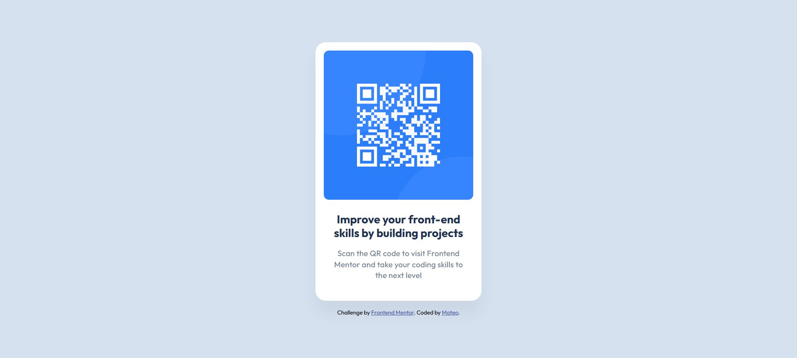

## Table of contents

- [Overview](#overview)
  - [Screenshot](#screenshot)
  - [Links](#links)
- [My process](#my-process)
  - [Built with](#built-with)
  - [What I learned](#what-i-learned)
  - [Continued development](#continued-development)
  - [Useful resources](#useful-resources)
- [Author](#author)
- [Acknowledgments](#acknowledgments)

## Overview

### Screenshot




### Links

- Solution URL: [Github solution]([https://your-solution-url.com](https://github.com/lordymarc/QR-code-component?tab=readme-ov-file))
- Live Site URL: [Live Site 4K for Free]([https://lordymarc.github.io/QR-code-component/])

## My process

### Built with

- Semantic HTML5 markup
- CSS custom properties
- Flexbox
- Love

### What I learned
how to center divs inside the body yk

```html
<body>
  <div class="QR-container">
  <div class="attribution">
</body>
```
```css
body{
  background-color: #D5E1EF;
  display: flex;
  flex-direction: column;
  justify-content: center;
  align-items: center;
  height: 100vh;
  row-gap: 15px;
  font-family: Outfit, sans-serif;
}
```

### Continued development

Grid and Flexboxes still confuse me. I'll work on them pinky promise

### Useful resources

- [MDN box-sizing](https://developer.mozilla.org/en-US/docs/Web/CSS/box-sizing) - no math no stress

## Author

- Website - [Add your name here](https://www.your-site.com)
- Frontend Mentor - [@lordymarc](https://www.frontendmentor.io/profile/lordymarc)

## Acknowledgments

Shoutout to Google fr
